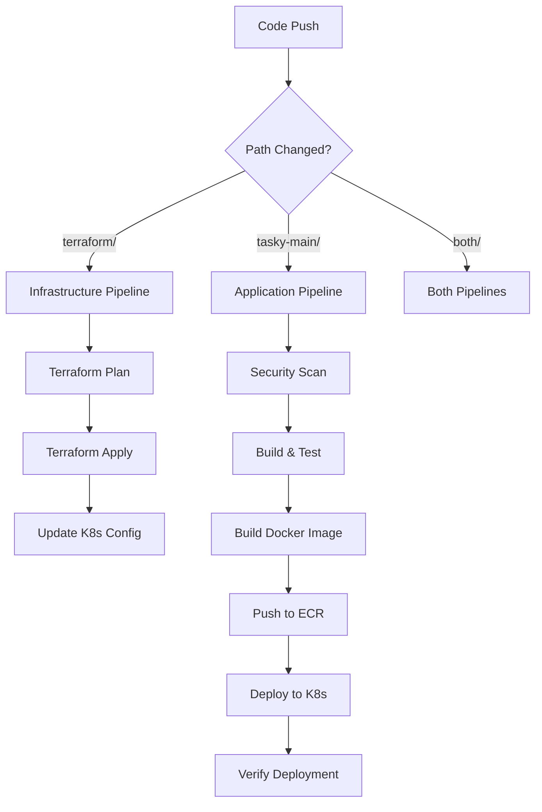

# CI/CD Pipeline Setup - Wiz Technical Exercise

## Overview

This project implements a comprehensive CI/CD pipeline using GitHub Actions with the following components:

1. **Infrastructure Pipeline** - Terraform deployment
2. **Application Pipeline** - Docker build and Kubernetes deployment  
3. **Security Scanning** - Automated security checks

## 📋 Pipeline Requirements Met

###  **Infrastructure-as-Code Pipeline**
- Terraform plan/apply on infrastructure changes
- Automated validation and formatting checks
- EKS cluster configuration and kubectl setup
- MongoDB IP injection into Kubernetes manifests

###  **Application Pipeline**
- Docker image build and push to ECR
- Kubernetes deployment automation
- Container image scanning with Trivy
- Application testing and verification

### **Security Controls**
- **TFSec** - Terraform security scanning
- **Checkov** - Infrastructure security scanning  
- **Trivy** - Container vulnerability scanning
- **Gosec** - Go code security scanning
- **SARIF** - Results uploaded to GitHub Security tab

##  Setup Requirements

### **GitHub Secrets Required**
```bash
AWS_ACCESS_KEY_ID=your_aws_access_key
AWS_SECRET_ACCESS_KEY=your_aws_secret_key
```

### **AWS Permissions Required**
- ECR repository access
- EKS cluster management
- Terraform resource creation
- S3 bucket access

## 📁 Repository Structure

```
wiz-exercise/
├── .github/workflows/          # GitHub Actions workflows
│   ├── infrastructure.yml      # Terraform deployment
│   ├── application.yml         # App build & deploy
│   └── security-scan.yml       # Security scanning
├── terraform/                  # Infrastructure code
│   ├── modules/               # Terraform modules
│   └── main.tf               # Root configuration
├── tasky-main/                # Application code
│   ├── k8s/                  # Kubernetes manifests
│   ├── Dockerfile            # Container definition
│   └── wizexercise.txt       # Required file
└── CICD_README.md            # This file
```

## 📁 Workflow Files

### **`.github/workflows/infrastructure.yml`**
- **Triggers**: Changes to `terraform/` directory
- **Jobs**:
  - `terraform-plan`: Validation and planning
  - `terraform-apply`: Infrastructure deployment
  - EKS cluster configuration
  - MongoDB IP extraction and injection

### **`.github/workflows/application.yml`**
- **Triggers**: Changes to Go code, Dockerfile, or K8s manifests in `tasky-main/`
- **Jobs**:
  - `security-scan`: Trivy vulnerability scanning
  - `build-and-test`: Go testing and wizexercise.txt verification
  - `build-and-push`: Docker build and ECR push
  - `deploy`: Kubernetes deployment and verification

### **`.github/workflows/security-scan.yml`**
- **Triggers**: Code changes or weekly schedule
- **Jobs**:
  - `tfsec`: Terraform security scanning
  - `checkov`: Infrastructure compliance scanning
  - `gosec`: Go code security analysis

## 🔄 Pipeline Flow



## Security Features

### **Pre-deployment Scanning**
- **Infrastructure**: TFSec, Checkov for Terraform security
- **Application**: Gosec for Go code vulnerabilities
- **Container**: Trivy for image vulnerabilities
- **Results**: All uploaded to GitHub Security tab

### **Post-deployment Verification**
- `wizexercise.txt` file verification in running container
- Kubernetes deployment status checks
- Application health checks

##  Usage

### **Manual Trigger**
```bash
# Trigger infrastructure deployment
gh workflow run infrastructure.yml

# Trigger application deployment  
gh workflow run application.yml

# Trigger security scanning
gh workflow run security-scan.yml
```

### **Automatic Triggers**
- **Push to main**: Full deployment pipeline
- **Pull Request**: Plan and security scanning only
- **Weekly**: Scheduled security scanning

## 📊 Monitoring

### **GitHub Security Tab**
- View all security scan results
- Track vulnerability trends
- Review compliance reports

### **Pipeline Status**
- Monitor deployment success/failure
- View build logs and artifacts
- Track deployment times

## 🔧 Troubleshooting

### **Common Issues**
1. **AWS Credentials**: Ensure secrets are properly configured
2. **ECR Repository**: Must exist before first deployment
3. **EKS Cluster**: Must be running before app deployment
4. **MongoDB Connection**: Verify EC2 instance is accessible

### **Debug Commands**
```bash
# Check workflow status
gh run list

# View workflow logs
gh run view <run-id>

# Re-run failed workflow
gh run rerun <run-id>
```

### **Additional Security Controls**
- **Dependency scanning**: Snyk for Go dependencies
- **Secret scanning**: GitGuardian integration
- **Compliance**: SOC2, PCI-DSS scanning

### **Advanced Features**
- **Blue-Green deployments**: Zero-downtime updates
- **Canary deployments**: Gradual rollouts
- **Rollback automation**: Automatic failure recovery
- **Performance testing**: Load testing in pipeline

### **Monitoring Integration**
- **Prometheus/Grafana**: Application metrics
- **ELK Stack**: Log aggregation
- **PagerDuty**: Alert integration 